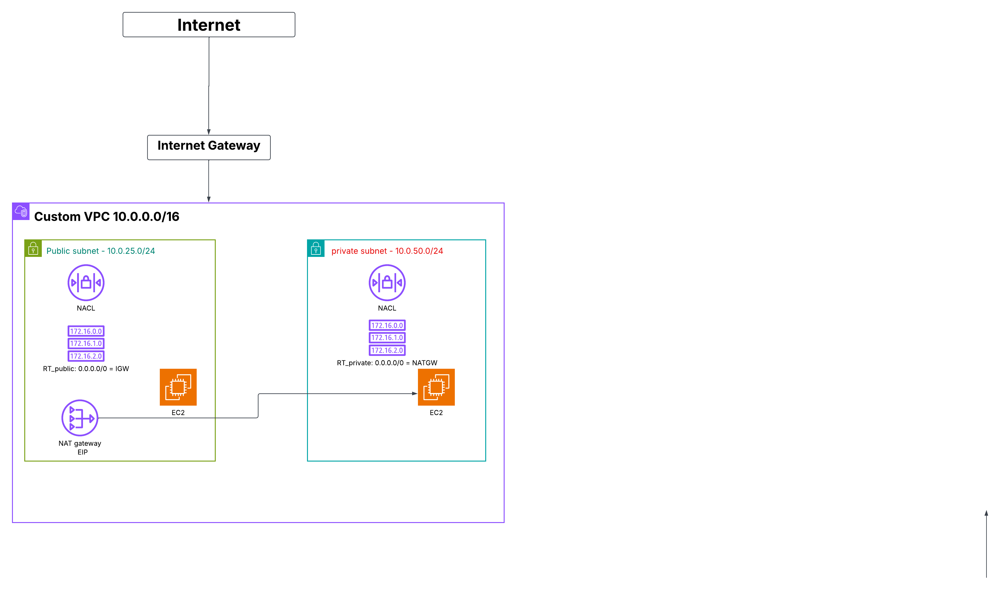

# AWS VPC Architecture Project

## Overview
A custom AWS VPC built with public and private subnet separation, controlled
internet access via a NAT Gateway, and secure instance management for both
the public-facing and private backend EC2 instances.

## Architecture Diagram

## Components
See the components that make up this network:
- Custom VPC (10.0.0.0/16)
- 1 Public Subnet, 1 Private Subnet
- Public EC2 instance — internet-facing, reachable via public IP
- Private EC2 instance — no public IP, isolated from inbound internet traffic
- Internet Gateway
- NAT Gateway
- Explicit public & private route tables
- Custom Network ACLs (NACLs)
- 
- ## Configuration Screenshots
See `/screenshots` for full configuration evidence, including:
- VPC details and CIDR block
- Public and private subnet configuration
- Public and private route tables
- Public-instance connection test (direct access)
- Private-instance SSM Session Manager success vs. SSH failure (proving subnet isolation)

- ## Connectivity Verification
See `connectivity-verification-theory.md` for the full write-up on how traffic
flows to both the public and private instances, and why access is controlled
as designed.

## Why it's built this way
- The public instance has a public IP and a route to the Internet Gateway, so
  it's directly reachable — as intended for a public-facing resource.
- The private instance has no public IP, so it can't be reached from the
  internet at all.
- SSH fails on the private instance on purpose — that's proof the isolation works.
- SSM Session Manager provides secure management access to the private
  instance without opening any inbound ports.
